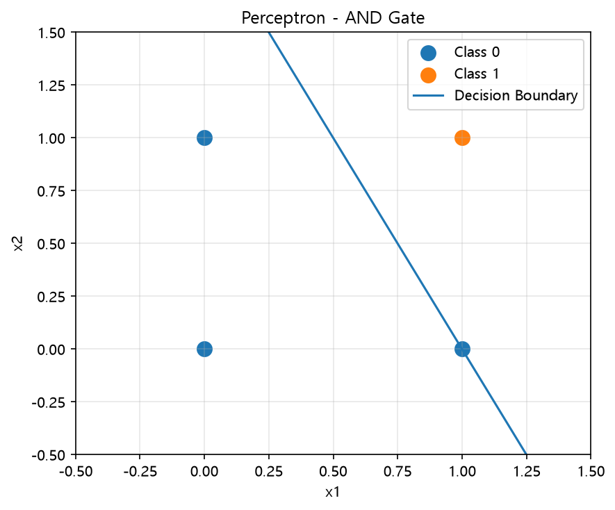

# Perceptron

Perceptron은 입력값에 가중치와 편향을 적용하고 활성화 함수를 통해 결과를 출력하는 **가장 기본적인 인공신경망 모델**이다.

이번 실습에서는 Perceptron을 직접 구현하고 AND 연산을 학습시켰다.

## 1. Perceptron 구조

Perceptron은 입력값에 각각의 가중치(Weight)를 곱하고 편향(Bias)을 더해 가중합을 계산한다.

```text id="p9g5fl"
x1 ── w1 ─┐
           ├─ 가중합 ─ 활성화 함수 ─ 출력
x2 ── w2 ─┘
       +
      bias
```

가중합은 다음과 같은 구조이다.

```text id="h8byq1"
weighted_sum = x1*w1 + x2*w2 + bias
```

* **Input** : 모델에 입력되는 값
* **Weight** : 각 입력값의 중요도를 조절하는 값
* **Bias** : 결정경계를 조정하는 값
* **Activation Function** : 가중합을 이용해 최종 출력을 결정

## 2. Step Function

이번 실습에서는 활성화 함수로 Step Function을 사용했다.

```python id="zts12u"
@staticmethod
def step_function(weighted_sum):
    return 1 if weighted_sum > 0 else 0  # 가중합이 0보다 크면 1, 아니면 0
```

가중합이 0보다 크면 `1`, 그렇지 않으면 `0`을 출력한다.

따라서 Perceptron은 입력값을 두 클래스로 분류하는 결정경계를 학습할 수 있다.

## 3. Perceptron 학습

Perceptron은 예측 결과와 실제 정답의 차이를 이용해 가중치와 편향을 수정한다.

```python id="wgvbfk"
pred = self.predict(inputs)
error = label - pred  # 실제값 - 예측값

self.w[1:] += lr * error * inputs  # 가중치 = 기존 가중치 + 학습률 × 오차 × 입력
self.w[0] += lr * error            # 편향 = 기존 편향 + 학습률 × 오차
```

학습 과정은 다음과 같다.

```text id="7cd7ks"
입력
 ↓
가중합
 ↓
활성화 함수
 ↓
예측
 ↓
실제 정답과 비교
 ↓
오차 계산
 ↓
가중치 / 편향 수정
 ↓
반복
```

### Learning Rate

`lr`은 한 번 학습할 때 가중치를 얼마나 수정할지 결정하는 **학습률(Learning Rate)**이다.

```python id="vdw5kz"
model.train(X, y, lr=0.1, epochs=100)
```

### Epoch

`epochs`는 전체 학습 데이터를 몇 번 반복해서 학습할 것인지를 의미한다.

이번 실습에서는 전체 데이터를 100번 반복했다.

## 4. AND Gate

Perceptron에 AND 연산을 학습시켰다.

| x1 | x2 | AND |
| -: | -: | --: |
|  0 |  0 |   0 |
|  0 |  1 |   0 |
|  1 |  0 |   0 |
|  1 |  1 |   1 |

```python id="3usf2j"
X = np.array([
    [0, 0],
    [0, 1],
    [1, 0],
    [1, 1]
])

y = np.array([0, 0, 0, 1])
```

학습이 진행되면서 Perceptron은 AND 연산을 구분할 수 있도록 가중치와 편향을 수정한다.

## 5. Decision Boundary

학습된 가중치와 편향을 이용하면 Perceptron의 결정경계를 확인할 수 있다.



AND 데이터는 하나의 직선으로 `0`과 `1`을 구분할 수 있기 때문에 단일 Perceptron으로 학습할 수 있다.

## 6. Artificial Neural Network

인공신경망(ANN)은 여러 Neuron을 연결하여 구성할 수 있다.

기본적인 신경망은 다음과 같은 Layer로 구성된다.

```text id="lr0jig"
Input Layer
     ↓
Hidden Layer
     ↓
Output Layer
```

* **Input Layer** : 데이터를 입력받는 층
* **Hidden Layer** : 입력값을 변환하면서 패턴을 학습하는 층
* **Output Layer** : 최종 예측 결과를 출력하는 층

Hidden Layer가 여러 개로 깊어지면 **Deep Neural Network**로 확장할 수 있다.

## 7. Activation Function

활성화 함수(Activation Function)는 Neuron의 가중합을 받아 다음 단계로 전달할 값을 결정한다.

이번 Perceptron에서는 **Step Function**을 사용했다.

신경망에서는 문제와 Layer에 따라 다양한 활성화 함수를 사용할 수 있다.

대표적으로:

* Step Function
* Sigmoid
* ReLU
* Softmax

등이 있다.

## 8. Loss Function과 Gradient Descent

### Loss Function

손실함수(Loss Function)는 **모델의 예측과 실제 정답의 차이를 수치로 나타내는 함수**이다.

```text id="wnrppg"
예측값 ↔ 실제값
      ↓
  Loss 계산
```

학습의 목표는 이 Loss를 줄이는 것이다.

### Gradient Descent

경사하강법(Gradient Descent)은 Loss가 작아지는 방향으로 모델의 파라미터를 반복적으로 수정하는 최적화 방법이다.

```text id="iw2xvn"
예측
 ↓
Loss 계산
 ↓
Loss가 감소하는 방향 확인
 ↓
Weight 수정
 ↓
반복 학습
```

이번에 직접 구현한 Perceptron의 가중치 수정과 이후 신경망에서 사용하는 학습 방법은 세부적인 방식에는 차이가 있지만, **오차를 줄이도록 가중치를 반복해서 수정한다**는 학습 흐름으로 연결해서 이해할 수 있다.

## 9. Deep Learning Framework

신경망과 딥러닝 모델을 직접 모든 과정부터 구현하지 않고 효율적으로 구성하고 학습할 수 있도록 다양한 Framework와 Library가 사용된다.

* **TensorFlow** : Google에서 개발한 머신러닝·딥러닝 프레임워크
* **PyTorch** : 현재 널리 사용되는 딥러닝 프레임워크
* **Keras** : 신경망 모델을 비교적 간단한 코드로 구성할 수 있는 고수준 API

### Google Brain / DeepMind

Google Brain과 DeepMind는 인공지능 연구와 딥러닝 발전 과정에서 중요한 역할을 해온 연구 조직이다.

TensorFlow는 Google Brain 팀에서 개발되었으며, 이후 Google의 AI 연구 조직은 Google DeepMind 체계로 통합되었다.

## 정리

* Perceptron은 **Input → Weight/Bias → Activation Function → Output** 구조를 가진다.
* 학습 과정에서 예측 오차를 이용해 Weight와 Bias를 수정한다.
* `lr`은 가중치를 얼마나 수정할지 결정하는 Learning Rate이다.
* `epochs`는 전체 데이터를 반복해서 학습하는 횟수이다.
* AND 연산은 하나의 선형 결정경계로 분리할 수 있어 단일 Perceptron으로 학습할 수 있다.
* 여러 Neuron과 Hidden Layer를 연결하면 ANN으로 확장할 수 있다.
* 신경망에서는 Activation Function, Loss Function, Gradient Descent가 중요한 학습 요소이다.
* TensorFlow, PyTorch, Keras 등의 도구를 이용해 신경망과 딥러닝 모델을 구현할 수 있다.
