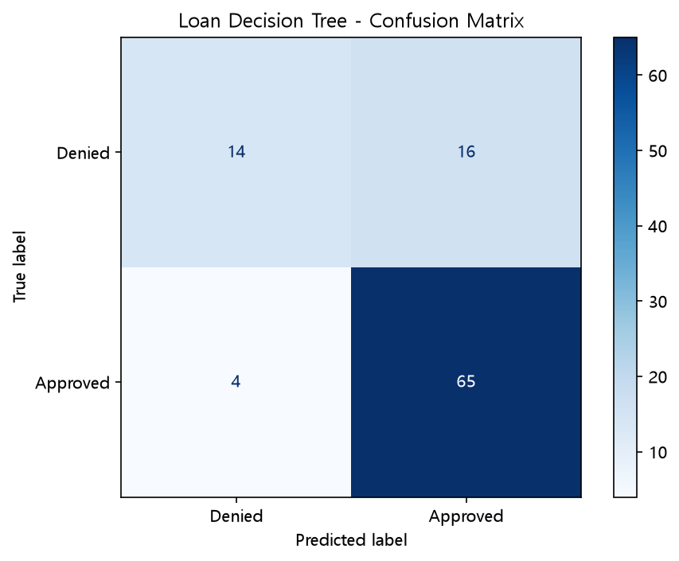
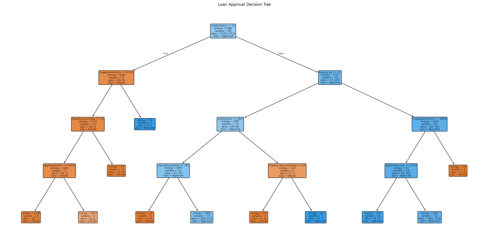
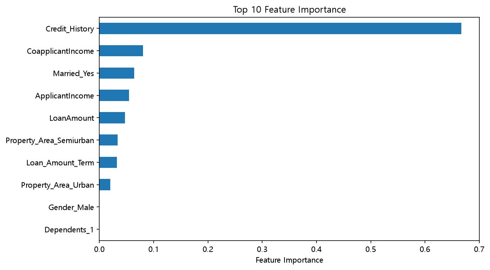

**# Decision Tree 
Loan Approval Dataset을 이용하여  
범주형 데이터를 전처리하고 **대출 승인 여부를 예측하는 Decision Tree 모델** 학습
- One-Hot Encoding
- Train / Test Split
- Entropy / Information Gain
- Tree Depth
- Accuracy
- Classification Report
- Confusion Matrix
- Feature Importance
- Model Save / Load

---

## 1. Loan Dataset
```python
loan_data = pd.read_csv(
    "../datasets/decision/train_loan_80.csv"
)
```
대출 신청자의 정보를 이용하여 대출 승인 여부를 예측
(0 → Denied, 1 → Approved)
---

## 2. One-Hot Encoding
실제 데이터에는 문자열 형태의 범주형 Feature가 포함될 수 있다.
```python
loan_encoded = pd.get_dummies(
    loan_data,
    drop_first=True,
    dtype=int
)
```
범주형 데이터를 `0 / 1` 형태의 숫자 Feature로 변환
(예: Gender == Gender_Male / Married == Married_Yes)

`drop_first=True`는 각 범주의 첫 번째 값을 제거하여 중복되는 Feature를 줄인다.

---

## 3. Feature / Target

```python
X = loan_encoded.drop(columns=["Loan_Status_Y"])
y = loan_encoded["Loan_Status_Y"]
```

```text
X → 대출 승인 여부를 판단할 Feature
y → 실제 대출 승인 여부
```

---

## 4. Train / Test Split

```python
X_train, X_test, y_train, y_test = train_test_split(
    X,
    y,
    test_size=0.2,
    random_state=42,
    stratify=y
)
```

| 옵션 | 의미 |
|---|---|
| `test_size=0.2` | 전체 데이터의 20%를 Test로 사용 |
| `random_state=42` | 분할 결과 고정 |
| `stratify=y` | 승인 / 거절 클래스 비율 유지 |

---

## 5. Entropy
이번 Decision Tree에서는 분할 기준으로 `entropy`를 사용

```python
model = DecisionTreeClassifier(
    criterion="entropy",
    max_depth=4,
    random_state=42
)
```
Entropy는 노드 안의 데이터가 얼마나 섞여 있는지를 나타낸다.

```text
한 Class만 존재
→ Entropy 낮음

여러 Class가 섞임
→ Entropy 높음
```
Decision Tree는 분할 후 **Entropy가 최대한 감소하도록** 조건을 선택

---

## 6. Information Gain
== 데이터를 분할했을 때 Entropy가 얼마나 감소했는지

```text
Information Gain
= 분할 전 Entropy - 분할 후 Entropy
```

Decision Tree는 일반적으로 **Information Gain이 큰 분할**을 선택한다.

```text
현재 Node
   ↓
여러 Feature 조건 비교
   ↓
Entropy 감소 계산
   ↓
좋은 분할 선택
```

---

## 7. max_depth

```python
max_depth=4
```

```text
Depth 너무 작음
→ 모델 단순
→ Underfitting 가능

Depth 너무 큼
→ Train 데이터 세밀하게 학습
→ Overfitting 가능
```

---

## 8. 모델 학습 / 예측

```python
model.fit(X_train, y_train)
y_pred = model.predict(X_test)
```

```text
fit()→ Train 데이터로 Tree 생성
predict()→ 생성된 Tree를 이용하여 Test 데이터 예측
```

---

## 9. Train / Test Accuracy

```python
train_accuracy = model.score(X_train, y_train)
test_accuracy = model.score(X_test, y_test)
```
Train과 Test 정확도를 함께 비교한다.

```text
Train ≈ Test    → 일반화가 비교적 안정적
Train >> Test   → Overfitting 가능성
```
Accuracy 하나만 확인하는 것보다 **Train과 Test 성능 차이도 함께 확인**
---

## 10. Classification Report

```python
classification_report(
    y_test,
    y_pred,
    target_names=["Denied", "Approved"]
)
```
주요 평가 지표:

| 지표 | 의미 |
|---|---|
| Precision | 해당 Class라고 예측한 것 중 실제 정답 비율 |
| Recall | 실제 해당 Class 중 모델이 찾아낸 비율 |
| F1 Score | Precision과 Recall의 균형 |
| Support | 실제 데이터 개수 |

---

## 11. Confusion Matrix

```python
cm = confusion_matrix(y_test,y_pred)
```
분류 결과를 실제값과 예측값으로 나누어 확인한다.

```text
              Predict
            Denied Approved
Actual Denied    ○      ○
       Approved  ○      ○
```

### 실행 결과


대각선의 값은 올바른 예측이고, 대각선 밖의 값은 오분류

```text
대각선 ↑     → 올바른 분류 증가
대각선 밖 ↑   → 오분류 증가
```

---

## 12. Decision Tree 시각화

```python
plot_tree(
    model,
    feature_names=X.columns,
    class_names=["Denied", "Approved"],
    filled=True,
    rounded=True
)
```

### 학습된 Decision Tree


Tree를 통해 모델이 어떤 Feature와 조건을 이용하여 대출 승인 여부를 판단했는지 확인

```text
Root Node
   ↓
Feature 조건
   ↓
True / False
   ↓
다음 Node
   ↓
Denied / Approved
```
Decision Tree는 **모델의 판단 과정을 시각적으로 확인하기 쉽다**

---

## 13. Feature Importance

```python
importance = pd.Series(
    model.feature_importances_,
    index=X.columns
).sort_values(
    ascending=False
)
```
각 Feature가 Tree의 분할에 얼마나 기여했는지 확인

### Top 10 Feature Importance



```text
Feature Importance 높음   → Tree 분할 과정에서 상대적으로 큰 역할
Feature Importance 낮음   → 상대적으로 적게 사용
```
단, 이번에도
**Feature Importance가 높다고 해당 Feature가 대출 승인의 원인이라는 의미는 아니다.**

---

## 14. 모델 저장

```python
joblib.dump(model, "loan_model.pkl")
```
이후 다시 학습하지 않고 모델을 불러와 사용할 수 있다.

---

## 15. Feature 정보 저장

```python
joblib.dump(list(X.columns), "model_features.pkl")
```
모델뿐 아니라 **학습 당시 사용한 Feature 이름과 순서**도 저장
One-Hot Encoding을 사용하면 
실제 서비스에서 새로운 데이터를 처리할 때 Feature 구성이 달라질 수 있기 때문

---

## 16. 저장된 모델 불러오기

```python
loaded_model = joblib.load("loan_model.pkl")
loaded_features = joblib.load("model_features.pkl")
```

저장된 모델을 다시 불러와 예측에 사용
```python
loaded_model.predict(new_data)
```

---**

## 17. 학습 흐름

```text
Loan Dataset
     ↓
One-Hot Encoding
     ↓
Feature / Target
     ↓
Train / Test Split
     ↓
Decision Tree
Entropy + max_depth
     ↓
모델 학습
     ↓
Train / Test Accuracy
     ↓
Classification Report
     ↓
Confusion Matrix
     ↓
Tree 시각화
     ↓
Feature Importance
     ↓
Model / Feature 저장
```

---

## 18. 주요 코드

### One-Hot Encoding

```python
loan_encoded = pd.get_dummies(
    loan_data,
    drop_first=True,
    dtype=int
)
```

### Decision Tree

```python
model = DecisionTreeClassifier(
    criterion="entropy",
    max_depth=4,
    random_state=42
)
```

### 학습 / 예측

```python
model.fit(X_train, y_train)
y_pred = model.predict(X_test)
```

### 모델 평가

```python
accuracy_score(y_test, y_pred)
classification_report(y_test,y_pred)
confusion_matrix(y_test,y_pred)
```

### Feature Importance

```python
model.feature_importances_
```

### 모델 저장

```python
joblib.dump(model, "loan_model.pkl")
joblib.dump(list(X.columns), "model_features.pkl")
```

---

## 19. Basic → Practical

| Basic | Practical |
|---|---|
| Playing Golf / Iris | Loan Dataset |
| Tree 기본 구조 | 실제 대출 승인 분류 |
| One-Hot Encoding 기초 | 실제 범주형 데이터 전처리 |
| Tree Depth | `max_depth` 적용 |
| Overfitting | Train/Test 성능 비교 |
| Pruning | Entropy 기준 Tree |
| Feature Importance | Top Feature 분석 |
| Accuracy | Precision / Recall / F1 |
| Tree 시각화 | Confusion Matrix |
| - | Model Save / Load |

---

## 정리

- 실제 범주형 데이터는 One-Hot Encoding을 이용하여 숫자로 변환할 수 있다.
- `criterion="entropy"`를 사용하면 Entropy와 Information Gain을 기준으로 데이터를 분할한다.
- `max_depth`를 이용하여 Tree의 복잡도를 제한하고 과적합을 완화할 수 있다.
- Train/Test Accuracy를 함께 비교하여 일반화 성능을 확인한다.
- Classification Report와 Confusion Matrix를 이용하여 클래스별 성능과 오분류를 확인한다.
- Feature Importance를 통해 Tree 분할에 상대적으로 중요한 Feature를 확인할 수 있다.
- 학습된 모델과 Feature 정보를 저장하여 다시 사용할 수 있다.