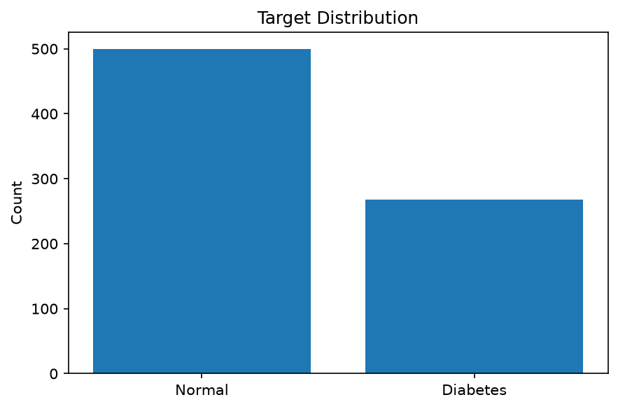
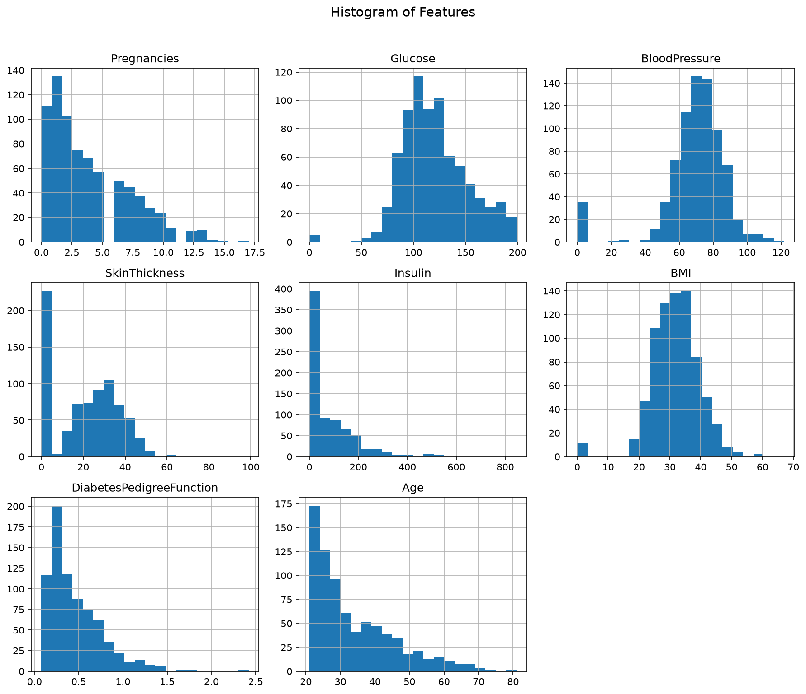
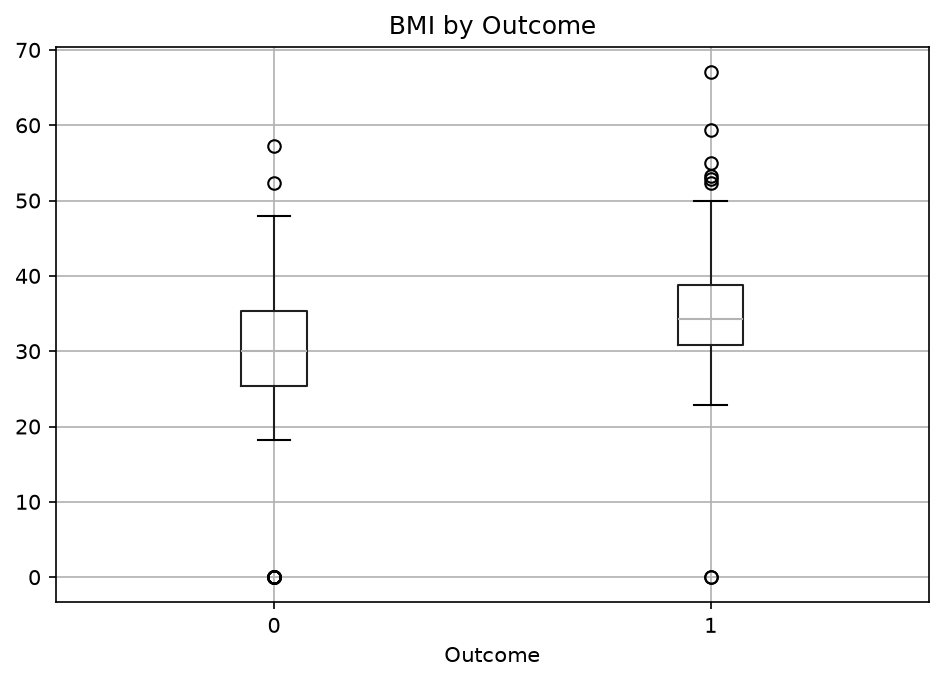
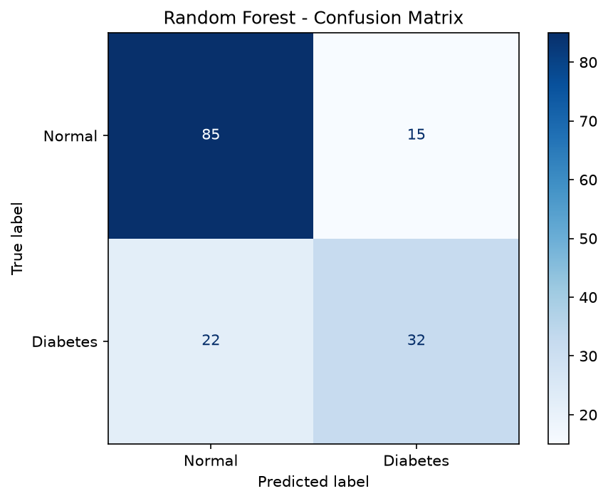
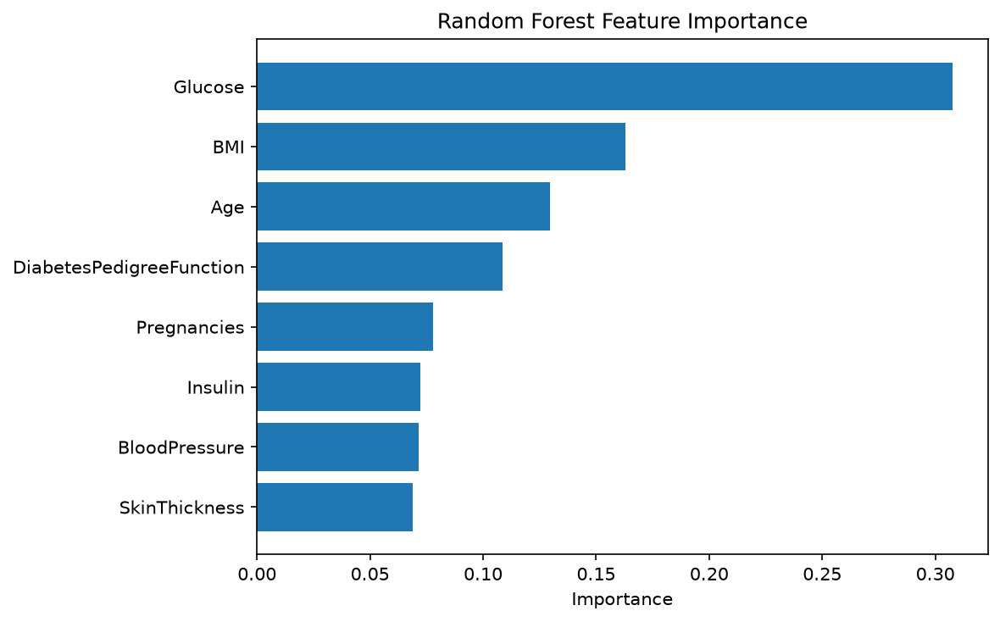

# Random Forest (Practical)
Pima Indians Diabetes Dataset을 이용하여  
Decision Tree와 Random Forest를 비교하고, 
Cross Validation과 GridSearchCV로 모델을 평가·튜닝

- Pima Indians Diabetes Dataset
- Decision Tree 기준 모델
- Random Forest
- Stratified K-Fold
- Cross Validation
- GridSearchCV
- Confusion Matrix
- Classification Report
- False Negative
- Feature Importance

---

## 1. Pima Indians Diabetes Dataset

```python
df = pd.read_csv("../datasets/pima-indians-diabetes.csv", names=cols)
```
Outcome = 0 → 정상 / Outcome = 1 → 당뇨

Feature:

```text
Pregnancies
Glucose
BloodPressure
SkinThickness
Insulin
BMI
DiabetesPedigreeFunction
Age
```

---

## 2. Target 분포

```python
y.value_counts()
```



정상과 당뇨 클래스의 개수 차이를 확인하여  
**Class Imbalance**가 어느 정도 존재하는지

---

## 3. Feature 분포

```python
df.drop(columns=["Outcome"]).hist(figsize=(12, 10), bins=20)
```



각 Feature의 값 범위와 분포 형태를 확인

---

## 4. Glucose / BMI와 Outcome



당뇨 그룹과 정상 그룹의 `Glucose`, `BMI` 분포를 비교
특히 `Glucose`는 두 그룹 간 차이가 상대적으로 뚜렷하게 나타날 수 있다.

---

## 5. Train / Test Split

```python
X_train, X_test, y_train, y_test = train_test_split(
    X,
    y,
    test_size=0.2,
    random_state=42,
    stratify=y
)
```
`stratify=y`를 사용하여 Train/Test에서 정상과 당뇨 비율을 비슷하게 유지

---

## 6. Decision Tree 기준 모델

```python
tree = DecisionTreeClassifier(
    max_depth=5,
    min_samples_split=10,
    min_samples_leaf=5,
    random_state=1
)
```
Random Forest와 비교하기 위한 기준 모델

```text
Decision Tree→ 하나의 Tree로 예측
```
Train/Test Accuracy를 함께 확인하여 과적합 여부를 확인

---

## 7. Random Forest

```python
forest = RandomForestClassifier(
    n_estimators=200,
    max_depth=7,
    max_samples=0.7,
    max_features="sqrt",
    random_state=42
)
```

```text
Training Data
      ↓
Bootstrap Sampling
      ↓
여러 Decision Tree
      ↓
일부 Feature 무작위 선택
      ↓
각 Tree 예측
      ↓
최종 결과 종합
```

Decision Tree 하나에 의존하지 않고  
여러 Tree를 결합하여 보다 안정적인 예측

---

## 8. 데이터 분할에 따른 성능 변화

```python
for rs in [0, 1, 2, 3, 4]:
```

`random_state`를 바꾸면서 Train/Test 데이터를 다르게 나누면  
Decision Tree의 Test Accuracy도 달라질 수 있다.

한 번의 Train/Test Split → 특정 데이터 분할에 성능이 영향을 받을 수 있음
따라서 여러 번 평가하는 Cross Validation이 필요

---

## 9. Stratified 5-Fold Cross Validation

```python
cv = StratifiedKFold(n_splits=5,shuffle=True,random_state=1)
```

```text
Fold 1 → Test
Fold 2 → Test
Fold 3 → Test
Fold 4 → Test
Fold 5 → Test
```
모든 데이터가 한 번씩 검증 데이터 역할을 한다.

`StratifiedKFold`를 사용하여 각 Fold에서도  
정상 / 당뇨 클래스 비율을 비슷하게 유지한다.

---

## 10. Decision Tree Cross Validation

```python
tree_cv = cross_val_score(
    DecisionTreeClassifier(...),
    X,
    y,
    cv=cv,
    scoring="accuracy"
)
```

각 Fold의 Accuracy를 구한 뒤 평균을 계산한다.

```text
Fold Accuracy
      ↓
평균 Accuracy
      ↓
모델의 일반화 성능 추정
```

---

## 11. Random Forest Cross Validation

```python
rf_cv = cross_val_score(
    RandomForestClassifier(
        n_estimators=300,
        random_state=1
    ),
    X,
    y,
    cv=cv
)
```

Decision Tree와 동일한 5-Fold 조건에서 Random Forest를 평가
(Random Forest가 특정 Train/Test 분할에 덜 민감한지 비교)

---

## 12. GridSearchCV

Random Forest의 Hyperparameter를 여러 조합으로 비교

```python
param_grid = {
    "n_estimators": [100, 200, 300, 400],
    "max_depth": [4, 6, 8, None],
    "min_samples_leaf": [1, 3, 5, 7]
}
```

```python
rf_grid = GridSearchCV(
    RandomForestClassifier(random_state=1),
    param_grid=param_grid,
    cv=cv,
    scoring="accuracy",
    n_jobs=-1
)
```

```text
4 × 4 × 4 = 64개
```

각 조합을 5-Fold로 평가하므로 여러 모델을 반복 학습하여  
평균 성능이 가장 좋은 설정을 찾는다.

---

## 13. Best Parameters

```python
rf_grid.best_score_
rf_grid.best_params_
```

- `best_score_` → 가장 높은 평균 CV Accuracy
- `best_params_` → 해당 성능을 만든 Hyperparameter 조합
- `best_estimator_` → 최적 설정이 적용된 모델

```python
best_rf = rf_grid.best_estimator_
```

---

## 14. 기본 Random Forest vs 튜닝 모델

```text
기본 Random Forest
        ↓
Cross Validation

튜닝 Random Forest
        ↓
GridSearchCV
        ↓
Best Parameters
```

Hyperparameter Tuning을 했다고 항상 성능이 크게 향상되는 것은 아니다.

중요한 것은 여러 설정을 동일한 평가 기준으로 비교하여  
더 적절한 모델을 선택하는 것이다.

---

## 15. 최종 Test 평가

```python
best_rf.fit(X_train, y_train)
best_pred = best_rf.predict(X_test)
```

Cross Validation과 GridSearchCV로 모델 선택을 완료한 뒤  
남겨둔 Test 데이터로 최종 성능을 확인한다.

```text
Train
  ↓
CV / GridSearchCV
  ↓
Best Model
  ↓
Final Test
```

---

## 16. Confusion Matrix

```python
cm = confusion_matrix(
    y_test,
    best_pred
)
```



구조:

```text
              예측
           정상   당뇨

실제 정상   TN     FP
실제 당뇨   FN     TP
```

- TN → 실제 정상, 정상으로 예측
- FP → 실제 정상, 당뇨로 잘못 예측
- FN → 실제 당뇨, 정상으로 잘못 예측
- TP → 실제 당뇨, 당뇨로 예측

---

## 17. False Negative

```text
실제 당뇨
   ↓
모델은 정상으로 예측
   ↓
False Negative
```

의료 분류에서는 실제 환자를 정상으로 놓치는 경우가 중요할 수 있으므로  
Accuracy만 보는 것보다 Recall과 FN도 함께 확인해야 한다.

---

## 18. Classification Report

```python
classification_report(
    y_test,
    best_pred,
    target_names=["Normal", "Diabetes"]
)
```

| 지표 | 의미 |
|---|---|
| Precision | 당뇨라고 예측한 것 중 실제 당뇨 비율 |
| Recall | 실제 당뇨 중 모델이 찾아낸 비율 |
| F1 Score | Precision과 Recall의 균형 |
| Support | 실제 해당 Class 데이터 수 |

당뇨 클래스에서는 특히 `Recall`을 확인한다.

```text
Recall 낮음→ 실제 당뇨 환자를 놓치는 경우가 많음
```

---

## 19. Feature Importance

```python
best_rf.feature_importances_
```

각 Feature가 Random Forest의 분할 과정에서  
상대적으로 얼마나 기여했는지 확인한다.



```text
Importance 높음 → 여러 Tree에서 분할에 상대적으로 많이 기여
```

단, Feature Importance가 높다고 해당 Feature가  
당뇨의 직접적인 원인이라는 의미는 아니다.

---

## 20. Practical 학습 흐름

```text
Pima Diabetes Dataset
        ↓
Target / Feature 분포 확인
        ↓
Train / Test Split
        ↓
Decision Tree
        ↓
Random Forest
        ↓
단일 분할 성능 변화 확인
        ↓
Stratified 5-Fold CV
        ↓
Decision Tree / Random Forest 비교
        ↓
GridSearchCV
        ↓
Best Random Forest
        ↓
Final Test
        ↓
Confusion Matrix
        ↓
Classification Report
        ↓
False Negative
        ↓
Feature Importance
```

---

## 21. 주요 코드

### Cross Validation

```python
cv = StratifiedKFold(
    n_splits=5,
    shuffle=True,
    random_state=1
)

rf_cv = cross_val_score(
    RandomForestClassifier(
        n_estimators=300,
        random_state=1
    ),
    X,
    y,
    cv=cv
)
```

### GridSearchCV

```python
rf_grid = GridSearchCV(
    RandomForestClassifier(random_state=1),
    param_grid=param_grid,
    cv=cv,
    scoring="accuracy"
)
```

### 최적 모델

```python
best_rf = rf_grid.best_estimator_

best_rf.fit(X_train, y_train)
best_pred = best_rf.predict(X_test)
```

### Confusion Matrix

```python
confusion_matrix(
    y_test,
    best_pred
)
```

### Feature Importance

```python
best_rf.feature_importances_
```

---

## 22. Basic → Practical

| Basic | Practical |
|---|---|
| Loan Dataset | Pima Diabetes Dataset |
| Random Forest 기본 구조 | Decision Tree와 비교 |
| Bootstrap Sampling | 데이터 분할 민감도 확인 |
| `n_estimators` | Stratified K-Fold |
| `max_samples` | Cross Validation |
| `max_features` | GridSearchCV |
| Accuracy | 최적 Hyperparameter |
| Classification Report | Confusion Matrix |
| Feature Importance | False Negative 분석 |

---

## 정리

- Random Forest는 여러 Decision Tree를 결합하여 예측한다.
- 단일 Train/Test Split 결과는 데이터 분할에 따라 달라질 수 있다.
- Stratified K-Fold를 이용하면 클래스 비율을 유지하며 여러 번 평가할 수 있다.
- Cross Validation 평균을 이용하면 일반화 성능을 더 안정적으로 추정할 수 있다.
- GridSearchCV를 이용하여 여러 Hyperparameter 조합을 자동으로 비교할 수 있다.
- 최종 Test 데이터는 모델 선택이 끝난 후 평가에 사용한다.
- 의료 분류에서는 Accuracy뿐 아니라 Recall과 False Negative를 함께 확인하는 것이 중요하다.
- Feature Importance를 통해 예측에 상대적으로 많이 기여한 Feature를 확인할 수 있다.