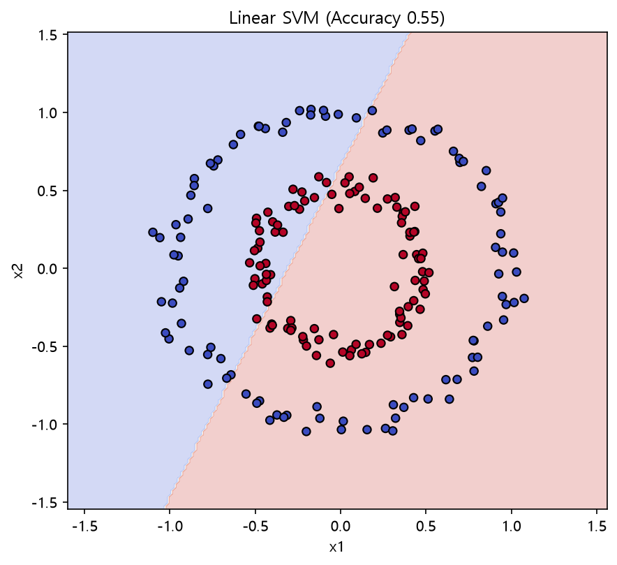
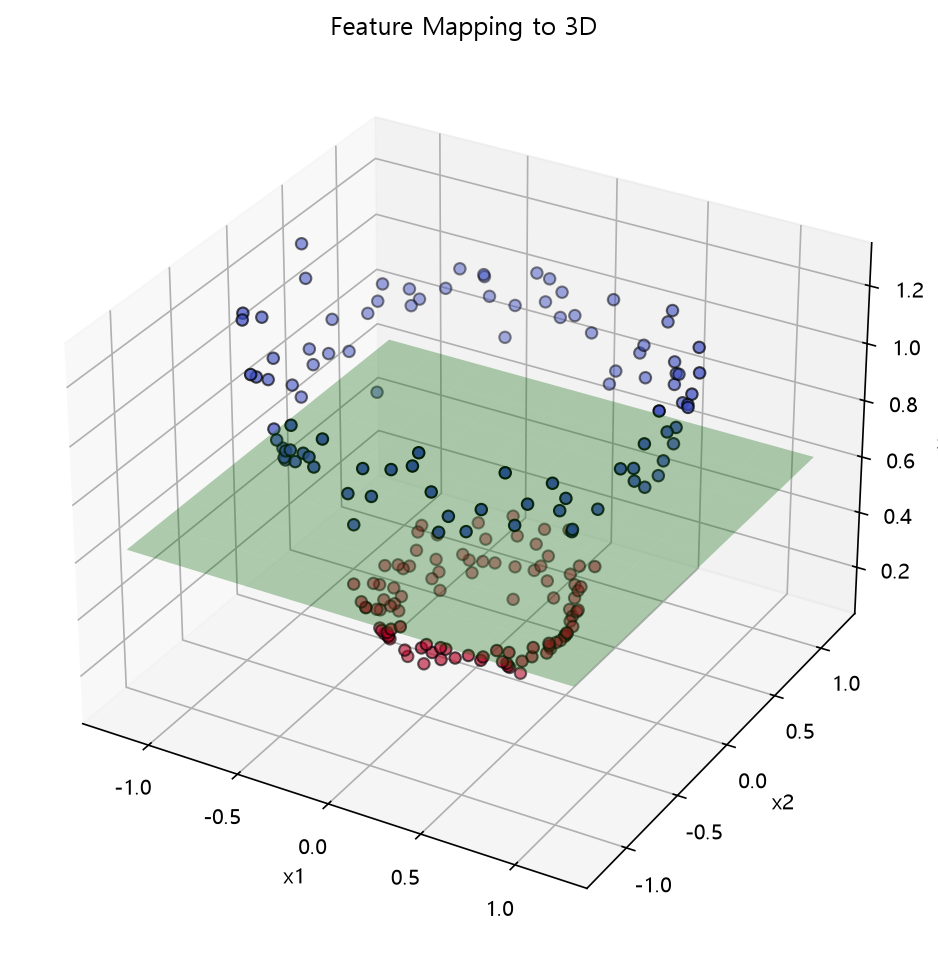
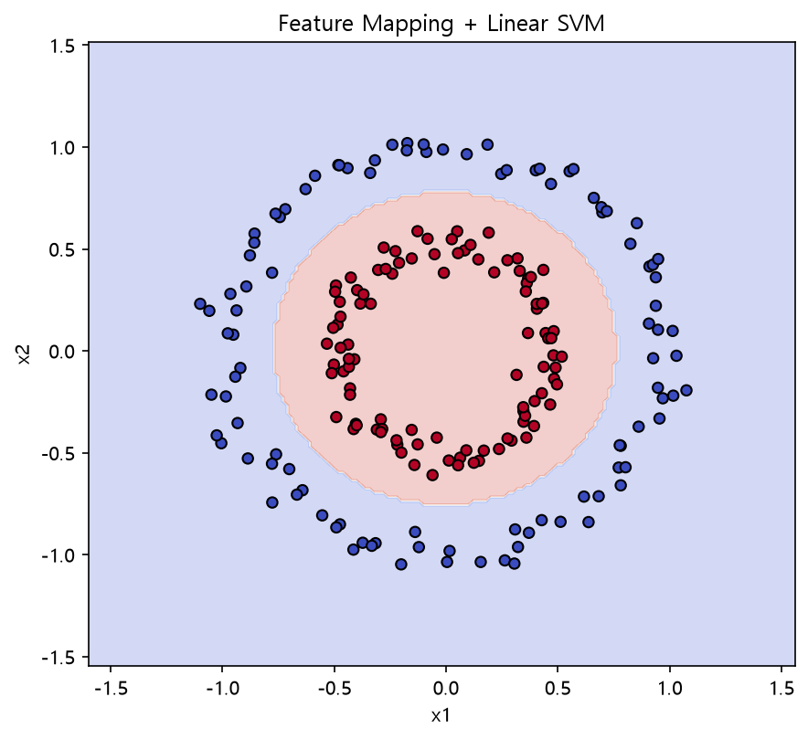
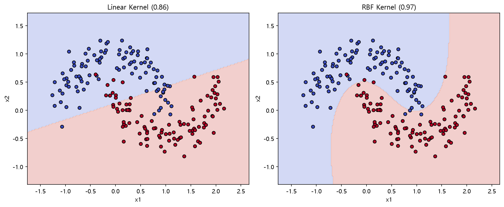

# SVM Decision Boundary

SVM의 **Linear Kernel과 RBF Kernel의 결정경계 차이**를 확인하고, 
비선형 데이터를 고차원 공간으로 변환하는 Feature Mapping과 Kernel Trick을 학습

## 1. Linear SVM

`make_circles()`를 이용해 안쪽 원과 바깥쪽 원으로 구성된 비선형 데이터를 생성했다.

```python
X, y = make_circles(
    n_samples=200,
    noise=0.05,
    factor=0.5,
    random_state=0
)
```

이 데이터에 Linear SVM을 적용했다.

```python
lin = SVC(kernel="linear").fit(X, y)
```



Linear Kernel은 **직선 형태의 결정경계**를 만들기 때문에 원형으로 구성된 두 클래스를 제대로 분리하기 어렵다.

즉, 원래 공간에서 선형적으로 분리할 수 없는 데이터에는 비선형적인 접근이 필요하다.

## 2. Feature Mapping

원형 데이터를 분리하기 위해 기존 2차원 데이터에 새로운 Feature를 추가했다.

기존 데이터:

```text
(x1, x2)
```

새로운 Feature를 추가하면:

```text
(x1, x2, x1² + x2²)
```

가 된다.

```python
def phi(P):
    return np.column_stack([
        P[:, 0],
        P[:, 1],
        P[:, 0] ** 2 + P[:, 1] ** 2  # 원점에서 멀수록 값이 커지는 새로운 Feature
    ])

Xm = phi(X)
```

`x1² + x2²`는 원점으로부터의 거리에 관련된 값이므로 안쪽 원과 바깥쪽 원을 서로 다른 높이로 이동시킬 수 있다.



2차원에서는 직선으로 구분하기 어려웠던 데이터가 3차원으로 변환되면서 **평면을 이용해 구분할 수 있는 형태**가 된다.

## 3. 고차원 공간과 비선형 결정경계

Feature Mapping 후 고차원 공간에서 Linear SVM을 적용했다.

```python
class PhiSVM:
    def __init__(self):
        self.model = SVC(kernel="linear")  # 고차원 공간에서는 Linear SVM 사용

    def fit(self, X, y):
        self.model.fit(phi(X), y)
        return self

    def predict(self, X):
        return self.model.predict(phi(X))
```

고차원 공간에서는 선형적인 평면으로 데이터를 분리하지만, 이 경계를 다시 원래 2차원 공간에서 보면 **비선형 결정경계**가 된다.



즉,

```text
2차원 비선형 데이터
        ↓
Feature Mapping
        ↓
고차원 공간
        ↓
Linear SVM으로 분리
        ↓
원래 공간에서는 비선형 결정경계
```

로 이해할 수 있다.

## 4. RBF Kernel

Scikit-learn에서는 직접 Feature Mapping 함수를 만들지 않고 Kernel을 이용해 비선형 데이터를 분류할 수 있다.

```python
rbf = SVC(
    kernel="rbf",
    gamma=1  # 클수록 각 데이터의 영향 범위가 좁아져 경계가 복잡해질 수 있음
).fit(X, y)
```


RBF Kernel은 원래 공간에서 직선으로 나누기 어려운 데이터에 **비선형 결정경계**를 만들 수 있다.

### gamma

`gamma`는 RBF Kernel에서 각 데이터가 영향을 미치는 범위와 관련된 하이퍼파라미터이다.

* `gamma`가 작음 → 영향 범위가 넓고 비교적 완만한 경계
* `gamma`가 큼 → 영향 범위가 좁고 복잡한 경계가 만들어질 수 있음

값이 지나치게 크면 훈련 데이터에 결정경계가 과도하게 맞춰질 수 있다.

## 5. Kernel Trick

Kernel을 이해하기 위해 Polynomial Feature Mapping과 내적을 직접 비교했다.

두 벡터를 고차원으로 변환한 뒤 내적을 계산한다.

```python
explicit = phi_poly(a) @ phi_poly(b)  # 실제로 고차원으로 변환한 뒤 내적
```

반면 Kernel Function을 이용하면 다음과 같이 계산할 수 있다.

```python
kernel = (a @ b + 1) ** 2  # Kernel Function으로 같은 내적 결과 계산
```

두 계산의 결과는 같다.

```text
φ(a) · φ(b)
      =
(a · b + 1)²
```

즉 **실제로 고차원 좌표를 모두 만들지 않고도 고차원 공간에서의 내적 결과를 계산**할 수 있다.

이를 **Kernel Trick**이라고 한다.

## 6. Linear vs RBF

`make_moons()`를 이용해 또 다른 비선형 데이터를 만들고 Linear Kernel과 RBF Kernel을 비교했다.

```python
X_moon, y_moon = make_moons(
    n_samples=200,
    noise=0.15,
    random_state=0
)

linear_moon = SVC(kernel="linear").fit(X_moon, y_moon)
rbf_moon = SVC(kernel="rbf").fit(X_moon, y_moon)
```



초승달 형태의 데이터 역시 하나의 직선으로 두 클래스를 완전히 구분하기 어렵다.

Linear Kernel과 RBF Kernel의 결정경계를 직접 비교하면 **데이터의 형태에 따라 Kernel 선택이 중요할 수 있음**을 확인할 수 있다.

## 정리

* **Decision Boundary**는 클래스를 구분하는 경계이다.
* Linear SVM은 선형적으로 분리하기 어려운 데이터에서 한계가 있다.
* **Feature Mapping**을 이용하면 데이터를 더 높은 차원의 공간으로 변환할 수 있다.
* 고차원에서는 선형 경계이더라도 원래 공간에서는 비선형 경계가 될 수 있다.
* **RBF Kernel**을 이용하면 직접 Feature Mapping을 만들지 않고 비선형 분류를 수행할 수 있다.
* `gamma`는 RBF Kernel에서 각 데이터의 영향 범위를 조절한다.
* **Kernel Trick**은 실제 고차원 좌표를 직접 계산하지 않고 고차원에서의 내적을 계산하는 방법이다.
