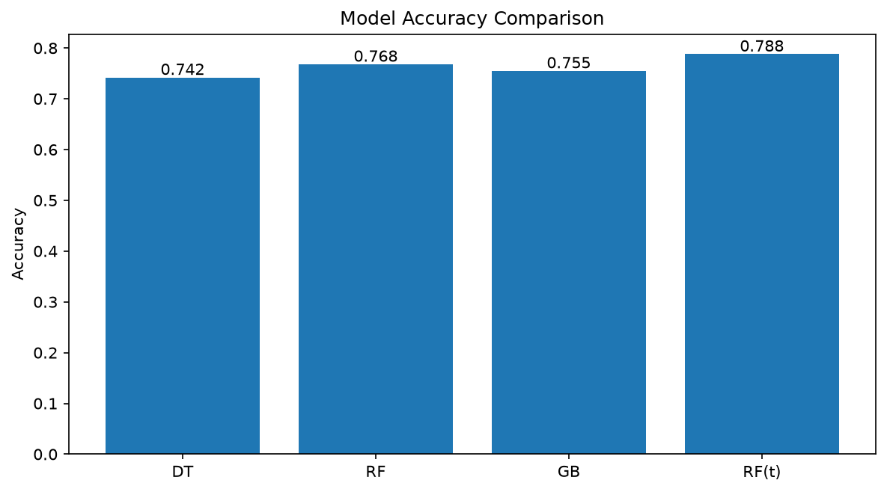
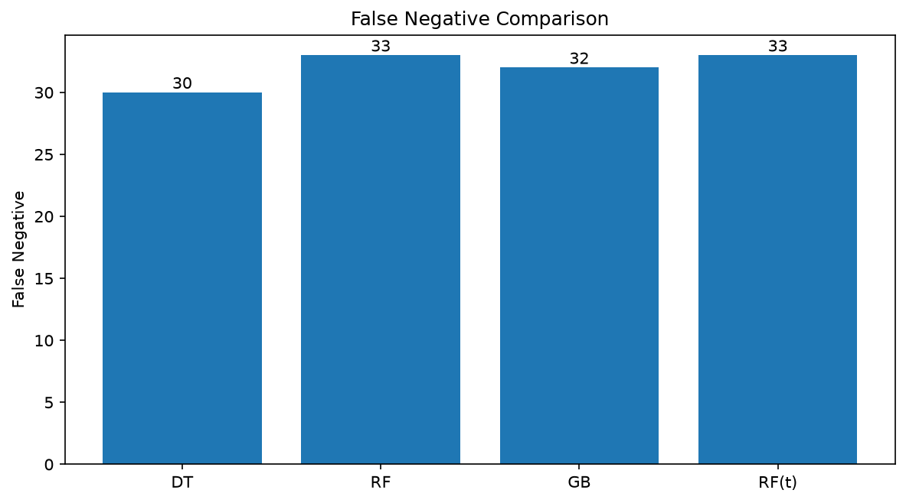

# Model Comparison
Pima Indians Diabetes Dataset을 이용하여  
지금까지 학습한 분류 모델의 성능을 동일한 조건에서 비교
- Decision Tree
- Random Forest
- Gradient Boosting
- Tuned Random Forest

---

## 모델 비교

`StratifiedKFold` 기반 5-Fold Cross Validation으로 모델의 평균 Accuracy를 비교

| Model | CV Accuracy |
|---|---:|
| Decision Tree | 0.742 |
| Random Forest | 0.768 |
| Gradient Boosting | 0.755 |
| Tuned Random Forest | **0.788** |



Cross Validation에서는 **Tuned Random Forest가 78.8%로 가장 높은 평균 정확도**를 보였다.

```text
DT     0.742
GB     0.755
RF     0.768
RF(t)  0.788  ← 최고
```

Random Forest는 Decision Tree보다 높은 평균 성능을 보였으며  
Hyperparameter Tuning 후 CV 성능이 `0.768 → 0.788`로 향상되었다.

---

## Test 데이터 평가

최종 Test 데이터 192개에 대해 동일한 조건으로 모델을 평가

| Model | Accuracy | TN | FP | FN | TP |
|---|---:|---:|---:|---:|---:|
| Decision Tree | **0.750** | 107 | 18 | **30** | **37** |
| Random Forest | **0.750** | **110** | **15** | 33 | 34 |
| Gradient Boosting | 0.740 | 107 | 18 | 32 | 35 |
| Tuned Random Forest | 0.745 | 109 | 16 | 33 | 34 |

Test Accuracy에서는 **Decision Tree와 Random Forest가 75.0%로 공동 최고**였다.

Tuned Random Forest는 CV에서는 가장 좋은 성능을 보였지만  
최종 Test Accuracy는 `74.5%`로 기본 Random Forest보다 높지 않았다.

```text
Cross Validation 성능이 높음
        ↓
새로운 Test 데이터에서도
반드시 가장 높은 성능을 보장하지는 않음
```

---

## False Negative 비교

FN(False Negative)은 **실제 당뇨 환자를 정상으로 잘못 예측한 경우**

| Model | FN | 당뇨 Recall | 당뇨 F1 |
|---|---:|---:|---:|
| Decision Tree | **30** | **0.552** | **0.607** |
| Random Forest | 33 | 0.507 | 0.586 |
| Gradient Boosting | 32 | 0.522 | 0.583 |
| Tuned Random Forest | 33 | 0.507 | 0.581 |



이번 Test 데이터에서는 **Decision Tree의 FN이 30으로 가장 낮았다.**

Decision Tree는 실제 당뇨 환자 67명 중 37명을 당뇨로 예측하여  
Recall이 약 **55.2%**로 네 모델 중 가장 높았다.

하지만 실제 당뇨 환자 67명 중 30명을 정상으로 예측했기 때문에  
현재 모델의 당뇨 탐지 성능이 충분히 높다고 보기는 어렵다.

---

## 결과 해석

이번 분석에서는 평가 기준에 따라 가장 좋은 모델이 달랐다.

```text
CV Accuracy 최고→ Tuned Random Forest (0.788)
Test Accuracy 최고→ Decision Tree / Random Forest (0.750)
FN 최소→ Decision Tree (30)
당뇨 Recall 최고→ Decision Tree (0.552)
```

특히 Hyperparameter Tuning을 적용한 Random Forest는  
Cross Validation 성능은 향상되었지만 Test 성능까지 향상되지는 않았다.

따라서

```text
높은 Accuracy
      ≠
항상 가장 좋은 모델
```

모델 선택은 Accuracy 하나만으로 결정하지 않고  
문제의 목적에 따라 **Precision / Recall / F1-score / FN** 등을 함께 고려해야 한다.

당뇨 예측처럼 실제 환자를 놓치는 것이 중요한 문제에서는  
**Recall과 False Negative를 특히 주의해서 확인**할 필요가 있다.

---

## 정리

- 동일한 데이터와 평가 방법으로 여러 분류 모델을 비교하였다.
- CV에서는 Tuned Random Forest가 `0.788`로 가장 높은 성능을 보였다.
- Test에서는 Decision Tree와 Random Forest가 `0.750`으로 공동 최고였다.
- Decision Tree의 FN이 `30`으로 가장 낮았다.
- Decision Tree의 당뇨 Recall도 `0.552`로 가장 높았다.
- Hyperparameter Tuning이 항상 Test 성능 향상으로 이어지는 것은 아니다.
- 모델은 하나의 지표가 아니라 **문제의 목적에 맞는 여러 평가 지표를 함께 고려하여 선택**한다.
