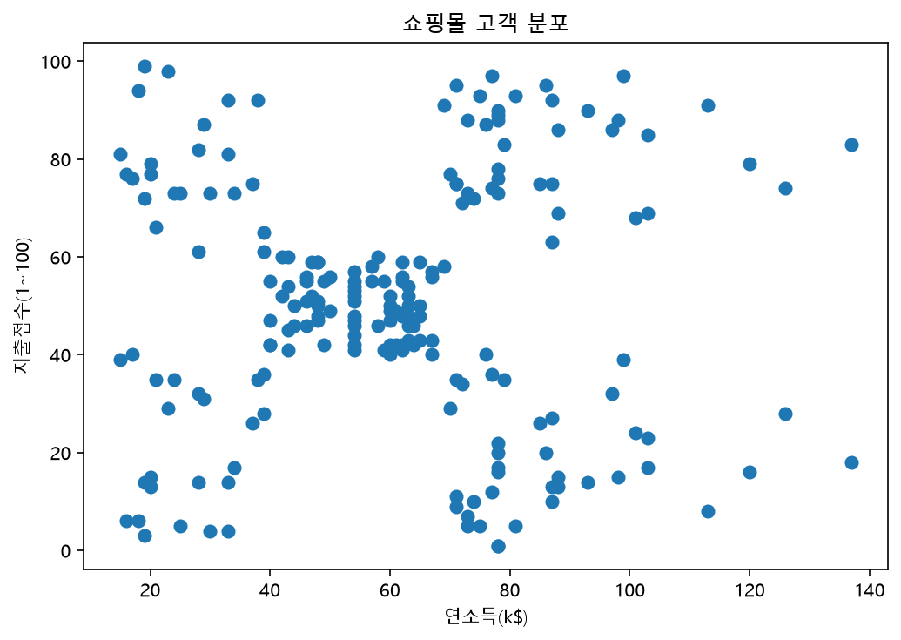
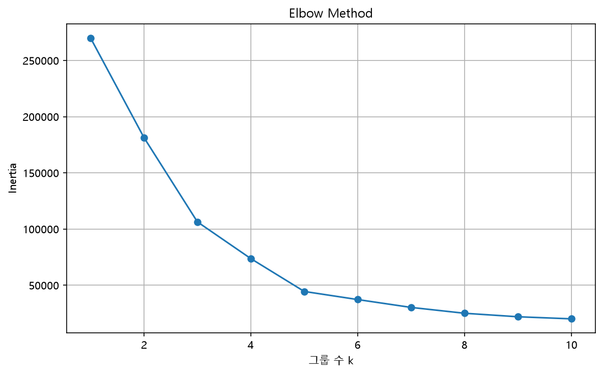
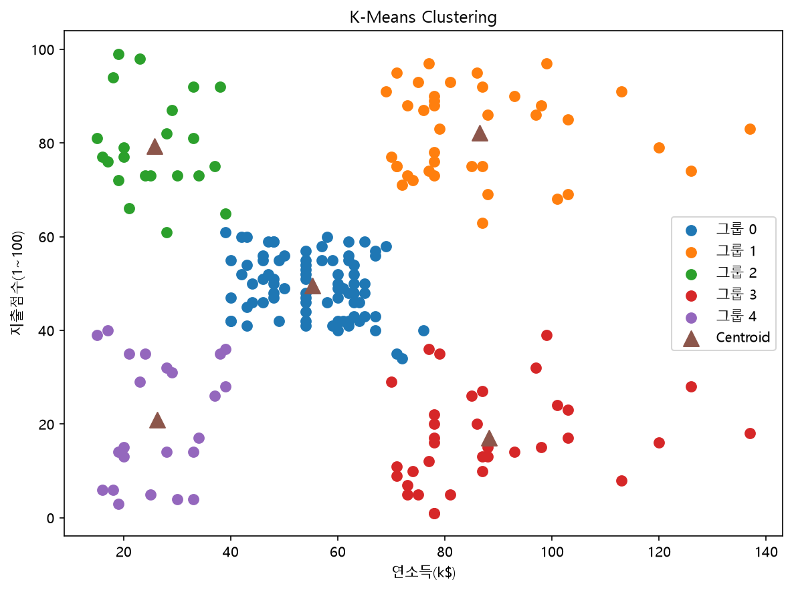

# Clustering

정답(Label)이 없는 데이터에서 비슷한 특징을 가진 데이터를 그룹으로 나누는 **비지도학습**
 쇼핑몰 고객의 **연소득(Annual Income)**과 **지출점수(Spending Score)**를 이용하여 고객을 군집화하는 연습

---

## 1. Customer Distribution

군집화에 사용할 두 Feature의 분포를 확인

- Annual Income : 연소득
- Spending Score : 지출점수



---

## 2. K-Means Clustering

데이터와 **Centroid(군집 중심점)** 사이의 거리를 기준으로 데이터를 K개의 그룹으로 나눈다.

```text
데이터
  ↓
K개의 Centroid 설정
  ↓
가장 가까운 Centroid에 데이터 할당
  ↓
Centroid 재계산
  ↓
반복
```

### 주요 Parameter

- `n_clusters` : 군집 개수 K
- `n_init` : 서로 다른 초기 중심점으로 반복 학습할 횟수
- `random_state` : 실행 결과 고정

---

## 3. Elbow Method

K-Means는 군집 개수 `K`를 직접 지정해야 한다.

**Inertia**는 각 데이터와 자신이 속한 Centroid 사이 거리의 제곱합이다.

```text
K 증가
→ Inertia 감소
→ 감소 폭이 완만해지는 지점 확인
→ 적절한 K 선택
```



이번 데이터에서는 약 **K=4~5** 부근에서 꺾이는 형태를 확인하고 `K=5`를 사용하였다.

---

## 4. K-Means Result

```python
kmeans = KMeans(
    n_clusters=5,
    random_state=42,
    n_init=10
)

labels = kmeans.fit_predict(X)
```



각 고객은 하나의 Cluster에 배정되고 `cluster_centers_`를 통해 각 군집의 Centroid를 확인할 수 있다.

학습된 모델은 새로운 고객이 어느 군집에 속하는지도 예측할 수 있다.

```python
group = kmeans.predict(new_customer)[0]
```

---

## 5. DBSCAN

**DBSCAN**은 데이터의 밀도를 기준으로 군집을 생성한다.

K-Means와 달리 군집 개수를 미리 지정하지 않는다.

```python
DBSCAN(
    eps=0.4,
    min_samples=5
)
```

- `eps` : 이웃으로 판단하는 거리
- `min_samples` : 핵심점이 되기 위한 최소 Sample 수
- `-1` : 어느 군집에도 속하지 않는 Noise

거리 기반 알고리즘이므로 `StandardScaler`를 이용하여 데이터를 표준화한 후 적용하였다.

---

## K-Means vs DBSCAN

| K-Means | DBSCAN |
|---|---|
| Centroid 기반 | 밀도 기반 |
| K를 미리 지정 | K 지정 불필요 |
| 모든 데이터를 군집에 할당 | Noise 구분 가능 |
| `n_clusters` | `eps`, `min_samples` |

---

## Summary

```text
Clustering
├── K-Means
│   ├── Centroid
│   ├── Inertia
│   ├── Elbow Method
│   └── New Data Prediction
│
└── DBSCAN
    ├── StandardScaler
    ├── eps
    ├── min_samples
    └── Noise (-1)
```

**K-Means** → 중심점을 기준으로 데이터를 K개의 그룹으로 분류  
**DBSCAN** → 데이터의 밀도를 기준으로 군집과 Noise를 탐색