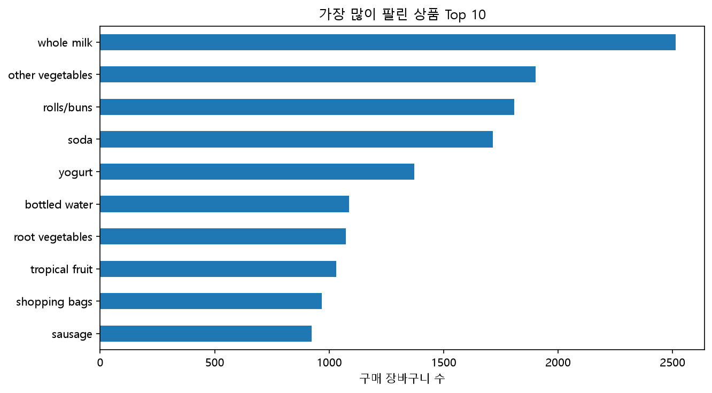

# Association Rule Analysis

거래 데이터에서 **함께 나타나는 상품의 패턴**을 찾는 비지도학습 방법
이번 실습에서는 Grocery Basket 데이터를 이용하여 
**Apriori Algorithm**으로 빈발 항목집합과 연관규칙을 탐색

---

## 1. Transaction Data
각 행은 하나의 장바구니(Transaction), 각 열은 상품

```text
Transaction
├── whole milk
├── yogurt
├── other vegetables
└── root vegetables
```

EDA: 상품별 구매 횟수를 확인



---

## 2. Frequent Itemsets

**Frequent Itemset**은 거래에서 자주 함께 등장하는 상품 조합

```python
frequent = apriori(
    basket,             # 장바구니 데이터
    min_support=0.02,   # 전체 거래의 2% 이상 등장한 조합만 추출
    use_colnames=True   # 상품명을 그대로 사용
)
```

```text
Transaction Data
      ↓
Apriori
      ↓
Frequent Itemsets
      ↓
Association Rules
```
각 Itemset에 몇 개의 상품이 포함되어 있는지 확인한다.

```python
# 각 상품 조합에 포함된 상품 개수
frequent["n_items"] = frequent["itemsets"].apply(len)

# 상품이 2개인 조합만 선택하고 지지도가 높은 순으로 정렬
pairs = (
    frequent[frequent["n_items"] == 2]
    .sort_values("support", ascending=False)
)
```
---

## 3. Association Rule
빈발 항목집합을 이용하여 다음과 같은 규칙을 생성한다.

```text
A → B

A를 구매한 경우
B도 함께 구매하는 경향이 있는가?
```

```python
rules = association_rules(
    frequent,           # Apriori로 찾은 빈발 항목집합
    metric="lift",      # Lift를 기준으로 규칙 생성
    min_threshold=1.0   # Lift가 1 이상인 규칙만 추출
)

# A를 구매했을 때 B도 구매한 비율이 30% 이상인 규칙만 선택
# 이후 Lift가 높은 순으로 정렬
rules = (
    rules[rules["confidence"] >= 0.3]
    .sort_values("lift", ascending=False)
)
```


규칙은 **Support, Confidence, Lift**를 이용하여 평가한다.

| 지표 | 의미 |
|---|---|
| Support | 전체 거래에서 A와 B가 함께 등장한 비율 |
| Confidence | A를 구매했을 때 B도 함께 구매한 비율 |
| Lift | 우연한 구매와 비교한 A와 B의 연관성 |

### Lift

```text
Lift > 1 → 양의 연관성
Lift = 1 → 특별한 연관성 없음
Lift < 1 → 음의 연관성
```
이번 분석에서는 `Lift >= 1`, `Confidence >= 0.3`인 규칙을 분석

---

## 4. Result

대표적으로 다음 규칙이 확인되었다.

```text
whole milk + other vegetables
→ root vegetables

Support    = 0.023
Confidence = 0.310
Lift       = 2.842
```

### 해석

- **Support 0.023** → 전체 거래의 약 2.3%에서 세 상품이 함께 구매됨
- **Confidence 0.310** → 우유와 기타 채소를 산 거래의 약 31%에서 뿌리채소도 구매
- **Lift 2.842** → 일반적인 경우보다 뿌리채소를 구매하는 경향이 약 2.84배 높음

또한 `yogurt + other vegetables → whole milk`의 Confidence는 약 **0.513**으로, 
요구르트와 기타 채소를 구매한 거래의 약 51.3%에서 우유도 함께 구매

---

## Summary

```text
Association Rule Analysis
        ↓
Transaction Data
        ↓
Apriori
        ↓
Frequent Itemsets
        ↓
Association Rules
        ↓
Support / Confidence / Lift
```

**Support** → 얼마나 자주 함께 등장하는가  
**Confidence** → A를 살 때 B도 얼마나 자주 사는가  
**Lift** → 우연에 비해 두 상품의 관계가 얼마나 강한가