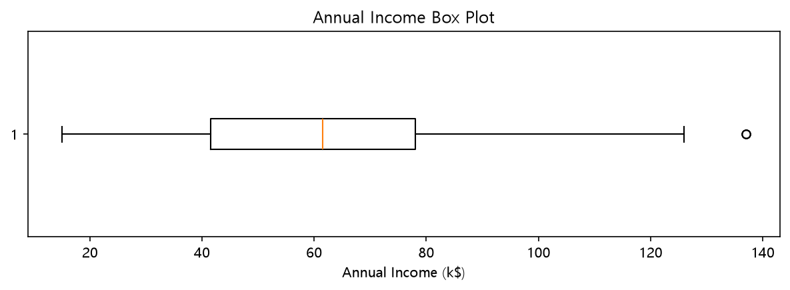
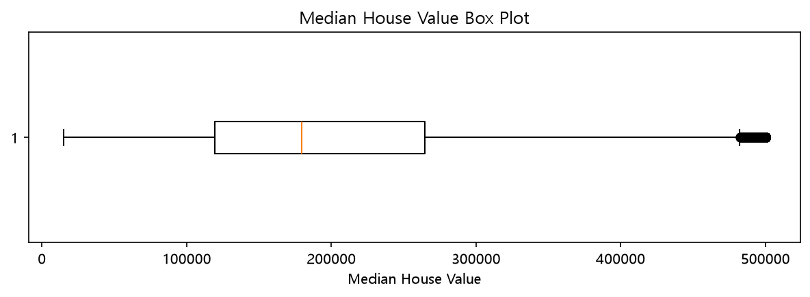

# Anomaly Detection

데이터에서 일반적인 범위를 벗어난 값을 **이상치(Outlier)**라고 한다.
 **IQR**과 **Z-score**를 이용해 이상치를 확인하고, 
California Housing 데이터에서 IQR 기준으로 이상치를 제거해봄

## 1. IQR 기반 이상치 탐지

IQR(Interquartile Range)은 데이터의 **Q1(25%)과 Q3(75%) 사이의 범위**이다.

```text
IQR = Q3 - Q1

하한 = Q1 - 1.5 × IQR
상한 = Q3 + 1.5 × IQR
```

(일반적으로 하한보다 작거나 상한보다 큰 값을 이상치로 판단)

### Mall Customers

`Annual Income`을 기준으로 IQR을 계산하고 정상 범위를 벗어난 데이터 찾기

```python
income = mall["Annual Income"]

q1 = income.quantile(0.25)
q3 = income.quantile(0.75)
iqr = q3 - q1

lower = q1 - 1.5 * iqr   # IQR 기준 정상 범위의 하한
upper = q3 + 1.5 * iqr   # IQR 기준 정상 범위의 상한

outliers = mall[(income < lower) | (income > upper)]
```

Box Plot을 이용하면 IQR과 이상치의 위치를 시각적으로 확인



## 2. Z-score 기반 이상치 탐지

Z-score는 
각 데이터가 **평균에서 표준편차의 몇 배만큼 떨어져 있는지** 확인

```python
z = (income - income.mean()) / income.std()
mall["income_z"] = z
```

일반적으로 Z-score의 절대값이 클수록 평균에서 멀리 떨어진 값 
일단 `|Z-score| > 3`을 기준으로 이상치를 확인해본다

```python
print("Z-score 절대값이 3보다 큰 데이터 수:", (z.abs() > 3).sum())

top5_index = z.abs().sort_values(ascending=False).index[:5]
print(mall.loc[top5_index, ["Annual Income", "income_z"]])
```

IQR은 **사분위수와 데이터의 분포 범위**를 이용하고, 
Z-score는 **평균과 표준편차**를 이용

## 3. California Housing 이상치 탐지

California Housing 데이터의 `median_house_value`를 대상으로 IQR 기반 이상치를 탐지했다.

```python
house_value = housing["median_house_value"]

q1 = house_value.quantile(0.25)
q3 = house_value.quantile(0.75)
iqr = q3 - q1

lower = q1 - 1.5 * iqr
upper = q3 + 1.5 * iqr

outlier_mask = (house_value < lower) | (house_value > upper)
```

`outlier_mask`는 각 행이 이상치인지 나타내는 Boolean Series이다.

Python에서는 `True`가 `1`, `False`가 `0`처럼 계산되므로
`sum()`을 이용해 이상치 개수를 구할 수 있다.

```python
print(f"이상치 개수: {outlier_mask.sum()}")
```



## 4. 이상치 제거

Boolean Series에 `~` 연산자를 적용하면 조건을 반대로 바꿀 수 있다.
따라서 이상치가 아닌 데이터만 선택해 정상 데이터를 만들었다.

```python
normal = housing[~outlier_mask]
```

이상치를 제거한 뒤 `median_house_value`의 표준편차를 계산했다.

```python
std = normal["median_house_value"].std()
std_trunc = np.trunc(std * 100) / 100  # 소수점 셋째 자리에서 버림

print(f"이상치 제거 후 표준편차: {std_trunc}")
```

## 정리

* **이상치(Outlier)**: 일반적인 데이터 범위에서 크게 벗어난 값
* **IQR**: Q1과 Q3 사이의 범위를 이용한 이상치 탐지
* **Z-score**: 평균과 표준편차를 이용해 데이터가 평균에서 얼마나 떨어져 있는지 확인
* **Box Plot**: 데이터의 분포와 이상치를 시각적으로 확인
* Boolean 조건을 이용해 이상치를 탐지하거나 제거할 수 있음
