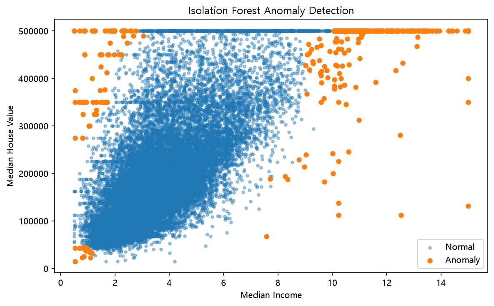

# Isolation Forest

> **추가 학습**
> IQR 기반 이상치 탐지 이후, 여러 Feature를 이용한 이상치 탐지 방법을 알아보기 위해 Isolation Forest를 학습

## 1. Isolation Forest

**Isolation Forest**는 데이터를 반복적으로 분할하면서 
다른 데이터보다 **쉽게 고립되는 관측치**를 이상치로 판단하는 알고리즘

일반적인 데이터는 주변에 비슷한 데이터가 많아 고립시키기 위해 여러 번의 분할이 필요하지만, 
이상치는 다른 데이터와 떨어져 있는 경우가 많아 상대적으로 적은 분할만으로 고립될 수 있다.

```text
적은 분할로 빠르게 고립 → 이상치일 가능성이 높음
많은 분할 후 고립       → 정상 데이터일 가능성이 높음
```

## 2. 데이터

California Housing 형식의 `housing.csv`를 사용했다.
Isolation Forest의 동작을 시각적으로 확인하기 위해 처음에는 두 개의 Feature만 사용

```python
features = ["median_income", "median_house_value"]
X = housing[features].copy()
```

* `median_income` : 지역의 중간 소득
* `median_house_value` : 지역의 중간 주택 가격

## 3. Isolation Forest 모델

```python
model = IsolationForest(
    contamination=0.02,  # 전체 데이터 중 이상치로 판단할 비율
    random_state=42      # 실행할 때마다 같은 결과가 나오도록 설정
)
```

### contamination

`contamination`은 데이터에서 어느 정도를 이상치로 판단할 것인지 설정

```python
contamination=0.02  #2%를 이상치로 판단
```


## 4. 이상치 탐지

```python
X["anomaly"] = model.fit_predict(X[features])
```

`fit_predict()`의 결과는 

|    값 | 의미     |
| ---: | ------ |
|  `1` | 정상 데이터 |
| `-1` | 이상치    |


```python
normal = X[X["anomaly"] == 1]
anomaly = X[X["anomaly"] == -1]
```

## 5. Anomaly Score

`decision_function()`  : 각 데이터의 이상 정도를 확인

```python
X["anomaly_score"] = model.decision_function(X[features])
```

**Anomaly Score가 작을수록 상대적으로 이상한 데이터**

```python
print(X.sort_values("anomaly_score").head(10))
```
어떤 데이터가 상대적으로 더 특이한지도 확인할 수 있다.

## 6. 결과 시각화

`median_income`과 `median_house_value`를 기준으로 
정상 데이터와 이상치를 Scatter Plot으로 비교



 **Feature의 조합에서 나타나는 특이한 패턴**을 탐지

## 7. IQR과 Isolation Forest

| 구분    | IQR              | Isolation Forest     |
| ----- | ---------------- | -------------------- |
| 기준    | Q1, Q3, IQR      | 데이터가 고립되는 정도         |
| 특징    | 개별 변수의 통계적 범위 확인 | 여러 Feature를 함께 사용 가능 |
| 결과    | 상한/하한 밖의 값 탐지    | 정상 `1`, 이상치 `-1`     |
| 주요 설정 | `1.5 × IQR`      | `contamination`      |

IQR은 특정 Feature의 값이 통계적인 정상 범위를 벗어나는지 확인하기 쉽다.

Isolation Forest는 여러 Feature를 함께 사용할 수 있어
**각 Feature만 봤을 때는 평범하지만 Feature 조합에서는 특이한 데이터**를 탐지하는 데 활용

## 8. Scaling

K-Means나 DBSCAN처럼 거리 계산을 중심으로 동작하는 알고리즘과 달리 
Isolation Forest는 데이터를 반복적으로 분할하여 관측치를 고립시키는 방식


## 정리

* Isolation Forest는 관측치를 **얼마나 쉽게 고립시킬 수 있는지**를 이용해 이상치를 탐지한다.
* `fit_predict()` 결과에서 `1`은 정상, `-1`은 이상치이다.
* `decision_function()`을 이용해 Anomaly Score를 확인할 수 있다.
* `contamination`으로 이상치로 판단할 비율을 설정할 수 있다.
* 여러 Feature의 조합에서 나타나는 특이한 패턴을 탐지할 수 있다.
* 거리 기반 알고리즘이 아니므로 `StandardScaler`가 필수는 아니다.
