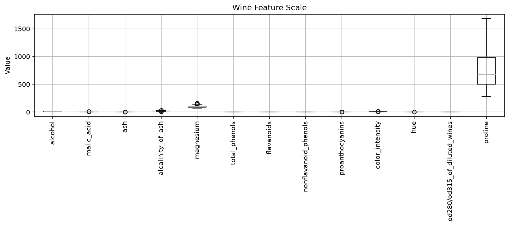
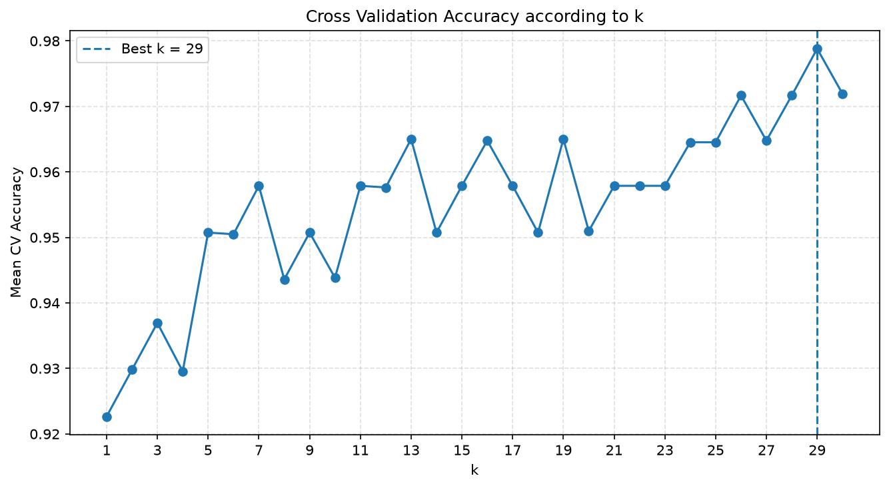
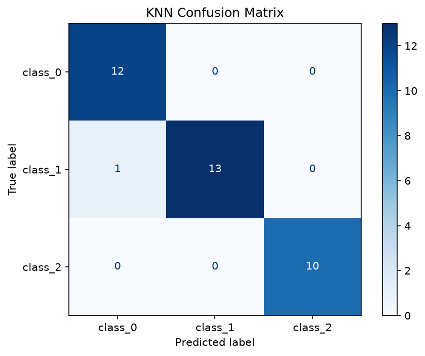

# K-Nearest Neighbors (KNN) - Practical

Wine Dataset을 이용하여 
KNN에서 **Feature Scaling과 k 선택이 모델 성능에 미치는 영향**을 확인

- Wine Dataset
- Feature Scale 확인
- StandardScaler
- Scaling 전 / 후 비교
- Pipeline
- 5-Fold Cross Validation
- 최적 k 선택
- Classification Report
- Confusion Matrix
- 모델 저장 / 불러오기

---

## 1. Wine Dataset
Scikit-learn의 `load_wine()` 데이터 사용

```python
wine = load_wine()
X = wine.data
y = wine.target
```

| 항목 | 내용 |
|---|---|
| 데이터 수 | 178 |
| Feature | 13 |
| Class | 3 |

```text
데이터 크기 : (178, 13)
Feature 수  : 13
클래스별 개수 : [59 71 48]
```

---

## 2. Feature Scale 확인
KNN은 데이터 사이의 **거리(Distance)** 를 이용하므로 
Feature의 값 범위 확인

```python
df[feature_names].describe().round(2).T[
    ["mean", "std", "min", "max"]
]
```
Wine 데이터는 Feature마다 값의 범위가 크게 다르다.

### Feature Scale


값의 범위가 큰 Feature는 거리 계산에서 상대적으로 더 큰 영향을 줄 수 있다.

---

## 3. Train / Test Split

```python
X_train, X_test, y_train, y_test = train_test_split(
    X,
    y,
    test_size=0.2,
    random_state=42,
    stratify=y
)
```

| 옵션 | 의미 |
|---|---|
| `test_size=0.2` | 전체의 20%를 Test로 사용 |
| `random_state=42` | 분할 결과 고정 |
| `stratify=y` | 클래스 비율 유지 |

```text
Train : (142, 13)
Test  : (36, 13)
```

---

## 4. Scaling 전 / 후 비교

### Scaling 전

```python
knn_unscaled = KNeighborsClassifier(n_neighbors=5)  # 가까운 이웃 5개 사용

knn_unscaled.fit(X_train, y_train)      # 원본 Feature로 KNN 학습
unscaled_pred = knn_unscaled.predict(X_test)  # Scaling하지 않은 Test 데이터 예측

unscaled_accuracy = accuracy_score(y_test,unscaled_pred)
```

### Scaling 후

```python
scaler = StandardScaler()  # Feature를 평균 0, 표준편차 1 기준으로 변환

X_train_scaled = scaler.fit_transform(X_train)  # Train에서 평균/표준편차 계산 후 변환
X_test_scaled = scaler.transform(X_test)        # Train에서 계산한 기준으로 Test만 변환
# fit_transform() : 기준 계산 + 변환
# transform()     : 기존 기준으로 변환
# Test 데이터에는 fit_transform()을 사용하지 않음
```

```python
knn_scaled = KNeighborsClassifier(n_neighbors=5)      # 동일하게 k=5 사용

knn_scaled.fit(X_train_scaled, y_train)               # Scaling된 Train 데이터로 학습
scaled_pred = knn_scaled.predict(X_test_scaled)       # Scaling된 Test 데이터 예측
scaled_accuracy = accuracy_score(y_test, scaled_pred) # Scaling 후 Accuracy 계산
```

`StandardScaler`는 각 Feature를 대략 다음 기준으로 변환한다.
```text
평균 ≈ 0
표준편차 ≈ 1
```

### 결과 해석

```text
Scaling 전 Accuracy : 실행 결과 확인
Scaling 후 Accuracy : 실행 결과 확인
```

Scaling 후 성능이 향상된다면
**Feature Scale 차이가 KNN 거리 계산에 영향을 주고 있었다는 의미**

> KNN, SVM처럼 거리 또는 Feature 크기의 영향을 받는 모델에서는 Scaling이 특히 중요하다.

---

## 5. `fit_transform()`과 `transform()`

```python
X_train_scaled = scaler.fit_transform(X_train)
X_test_scaled = scaler.transform(X_test)
```

| 코드 | 역할 |
|---|---|
| `fit_transform()` | Train에서 평균/표준편차 계산 + 변환 |
| `transform()` | Train에서 계산한 기준으로 변환 |

Test 데이터에는 `fit_transform()`을 사용하지 않는다.

```text
Train → 기준 계산 + 변환
Test  → Train 기준으로 변환만 수행
```

Test 데이터까지 이용해 Scaling 기준을 계산하면 **Data Leakage**가 발생할 수 있다.

---

## 6. Pipeline

```python
model = make_pipeline(
    StandardScaler(),    # Feature를 평균 0, 표준편차 1로 표준화
    KNeighborsClassifier(n_neighbors=5)
)
```

처리 흐름:

```text
원본 데이터
    ↓
StandardScaler
    ↓
KNeighborsClassifier
    ↓
예측
```
(make_pipeline(): 여러 처리 단계를 순서대로 묶어 하나의 모델처럼 만들어주는 함수)

Pipeline을 사용하면 Scaling과 KNN을 하나의 모델처럼 관리할 수 있어 
전처리 누락이나 데이터 처리 실수를 줄일 수 있다.

---

## 7. Cross Validation으로 k 선택

Basic에서는 Test Accuracy를 확인하면서 `k` 값을 비교했지만, 
실제 모델 선택 과정에서는 **Test 데이터를 사용하지 않는 것이 중요**

Train 데이터 안에서 5-Fold Cross Validation

```python
cv = StratifiedKFold(
    n_splits=5,       # 데이터를 5개 Fold로 나누어 교차검증
    shuffle=True,     # Fold를 나누기 전에 데이터 순서를 섞음
    random_state=42   # 데이터가 섞이는 결과를 위해- 고정
)
```

각 `k`에 대해:

```python
model = make_pipeline(
    StandardScaler(),
    KNeighborsClassifier(n_neighbors=k)
)

cv_scores = cross_val_score(
    model,
    X_train,
    y_train,
    cv=cv,
    scoring="accuracy"
)
```

```text
Train
 ├─ Fold 1
 ├─ Fold 2
 ├─ Fold 3
 ├─ Fold 4
 └─ Fold 5
       ↓
평균 Accuracy
```

`StratifiedKFold`는 각 Fold에서 클래스 비율을 비슷하게 유지한다.

---

## 8. 최적 k

```python
best_index = np.argmax(cv_means)
best_k = list(k_values)[best_index]
best_score = cv_means[best_index]
```

- `np.argmax()` → 가장 높은 값의 위치
- `best_k` → 가장 높은 평균 CV Accuracy를 보인 k
- `best_score` → 해당 k의 평균 CV Accuracy

### k별 Cross Validation 결과



### 해석
- `k`가 너무 작으면 주변 데이터에 민감해져 Overfitting 가능성이 높아진다.
- `k`가 너무 크면 서로 다른 클래스까지 많이 참고하여 Underfitting될 수 있다.
- 가장 높은 Train Accuracy가 아니라 **Cross Validation 성능이 좋은 k**를 선택한다.

---

## 9. 최종 모델

선택한 `best_k`를 이용하여 최종 모델을 만든다.

```python
final_model = make_pipeline(
    StandardScaler(),
    KNeighborsClassifier(
        n_neighbors=best_k
    )
)

final_model.fit(X_train, y_train)
y_pred = final_model.predict(X_test)
```

처음부터 남겨둔 Test 데이터는 **모델 선택이 끝난 후 최종 성능 확인에 사용**한다.

```text
Train
  ↓
Cross Validation
  ↓
best k 선택
  ↓
최종 모델 학습
  ↓
Test 평가
```

---

## 10. Classification Report

```python
classification_report(
    y_test,
    y_pred,
    target_names=target_names
)
```

| 지표 | 의미 |
|---|---|
| Precision | 해당 클래스로 예측한 것 중 실제 정답 비율 |
| Recall | 실제 해당 클래스 중 모델이 찾아낸 비율 |
| F1 Score | Precision과 Recall의 균형 |

Accuracy만 보는 것보다 **클래스별 분류 성능을 함께 확인**할 수 있다.

---

## 11. Confusion Matrix

```python
cm = confusion_matrix(
    y_test,
    y_pred
)
```

### 최종 분류 결과



대각선은 올바르게 분류한 데이터이고, 대각선 밖의 값은 오분류를 의미한다.

```text
대각선 값 ↑ → 올바른 분류 많음
대각선 밖 값 ↑ → 오분류 많음
```

3개의 Wine Class를 사용하므로 `3 × 3` Confusion Matrix가 생성된다.

---

## 12. 모델 저장

```python
joblib.dump(
    final_model,
    "wine_knn.pkl"
)
```

Pipeline 전체를 저장하기 때문에

```text
StandardScaler
+
KNN Model
```

이 함께 저장된다.

다시 사용할 때:

```python
loaded_model = joblib.load(
    "wine_knn.pkl"
)
```

별도로 `StandardScaler`를 다시 구성할 필요가 없다.

---

## 13. 이번 실습의 핵심

### Scaling

```text
Feature Scale 차이
        ↓
거리 계산 왜곡 가능
        ↓
StandardScaler
        ↓
거리 기준 통일
```

### k 선택

```text
여러 k 후보
    ↓
5-Fold Cross Validation
    ↓
평균 Accuracy 비교
    ↓
best k
```

### 최종 평가

```text
Train
  ↓
Cross Validation으로 모델 선택
  ↓
최종 모델
  ↓
Test
```

**Test 데이터는 마지막 평가용으로 남겨두는 것이 중요하다.**

---

## 14. 주요 코드

| 코드 | 역할 |
|---|---|
| `load_wine()` | Wine 데이터 불러오기 |
| `StandardScaler()` | Feature 표준화 |
| `fit_transform()` | 기준 계산 + 변환 |
| `transform()` | 기존 기준으로 변환 |
| `KNeighborsClassifier()` | KNN 모델 생성 |
| `make_pipeline()` | Scaling + KNN 연결 |
| `StratifiedKFold()` | 클래스 비율을 유지하는 Fold 생성 |
| `cross_val_score()` | Cross Validation |
| `np.argmax()` | 최고 성능 위치 탐색 |
| `classification_report()` | 클래스별 평가 |
| `confusion_matrix()` | 오분류 확인 |
| `joblib.dump()` | 모델 저장 |
| `joblib.load()` | 모델 불러오기 |

---

## 15. 정리

- KNN은 거리 기반 알고리즘이므로 Feature Scaling이 중요하다.
- `StandardScaler`를 이용해 Feature Scale을 맞출 수 있다.
- Pipeline으로 전처리와 KNN을 하나의 과정으로 관리할 수 있다.
- 최적 `k`는 Test가 아니라 Cross Validation을 이용해 선택하는 것이 적절하다.
- 최종 Test 데이터는 모델 선택이 끝난 후 성능 확인에 사용한다.
- Accuracy뿐 아니라 Classification Report와 Confusion Matrix도 함께 확인한다.
- Pipeline 전체를 저장하면 전처리와 모델을 함께 재사용할 수 있다.